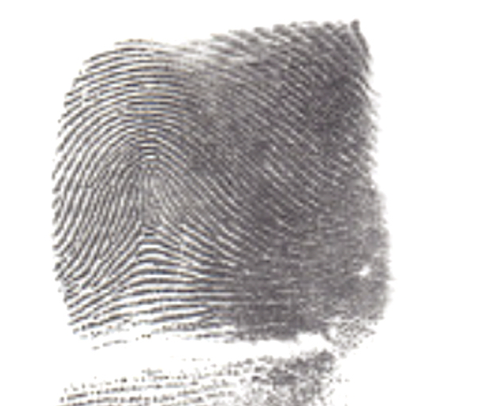
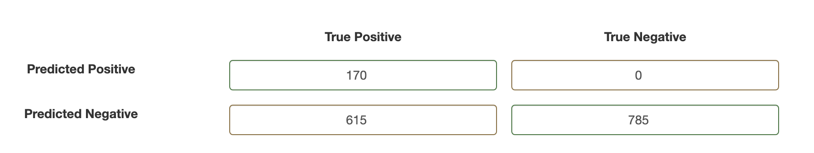
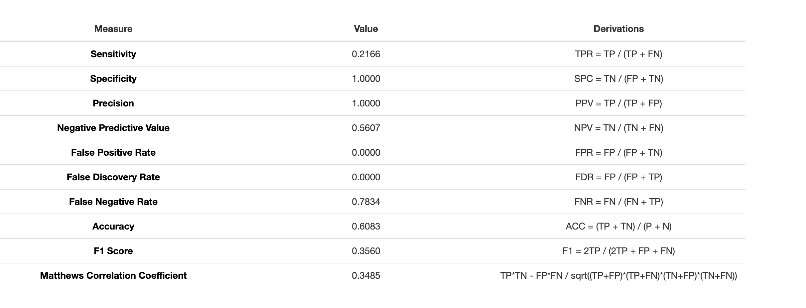
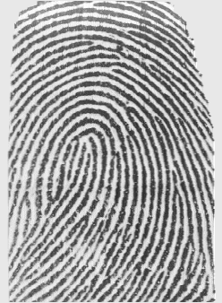
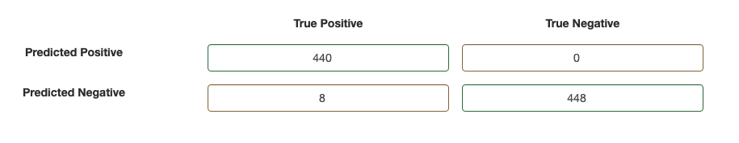
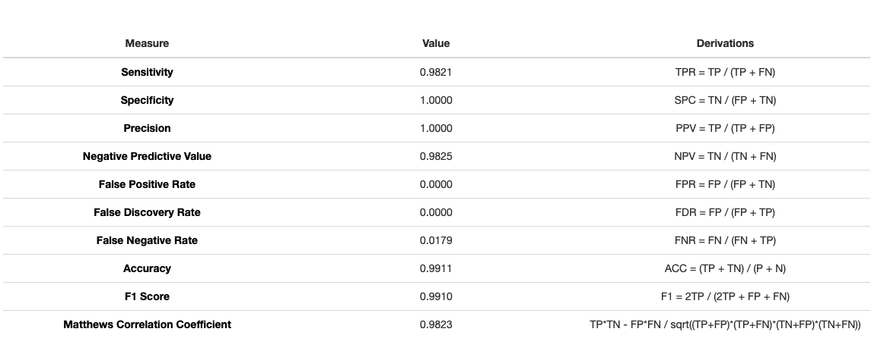

## README

This files presents the performance of SourceAFIS, an open source fingerprint matching software.
The link to software's main homepage is https://sourceafis.machinezoo.com/.

The performance of the algorithm is measured in the following two applications:

1. 1:1 matching; given a pair of fingerprint images, determines whether the two images come from the 
same finger or not.

2. 1:N matching; given a fingerprint, determine which images, if any, from a database of prints match
that fingerprint.

### Current Performance on Images in Box

Example of an image from the Box files:

For 1:1 matching, the OpenSourceAFIS algorithm has the following results:

In layman's terms, the algorithm is to be trusted when it says it has found a potential match. However, the
algorithm too frequently determines that are no match(es) when one or more do exist.

For 1:N matching, the OpenSourceAFIS algorithm has the following results:

- Approximately 10% of the time, the algorithm correctly indentified *all* matching prints in the
database (typically 3-4 images in the provided data).

- Approximately 35% of the time, the algorithm correctly identified at least one matching fingerprint.

- Very low rate false positives.

- Link to detailed results: https://docs.google.com/spreadsheets/d/1L8g8CDl8iLljO5X1tMXT8DqgZOMJk_8BOoZEbRV6pGQ/edit?usp=sharing

- The same issues exist as seen in 1:1 matching. 

# Performance on Clean Images

Example of a "clean" input image:

The following is the performance of the algorithm on clean input images:

- Given clean input data, the software performs very well.

